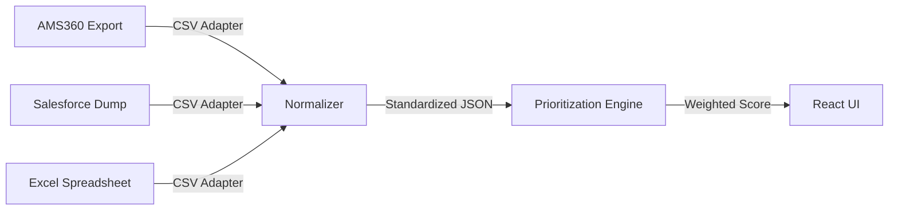

# P1: The Enterprise Bridge - Intelligent CSV Renewal System

## 🚀 Mission Statement
P1 is the rapid-deployment arm of the Broker Copilot. It acknowledges that **90% of the industry's data lives in static CSVs**, and transforms that dormant data into an active, prioritized renewal pipeline instantly, without complex database migrations.

> **⚠️ MANDATORY ARCHITECTURE STATEMENT**:
> **"No document ingestion, RAG, or embeddings/vector DB used. This system utilizes connector-first in-context synthesis only."**

---

## 🏗️ Architecture: The Universal Adapter

P1 utilizes a **fault-tolerant adapter pattern** to ingest any structured data source and normalize it for the Intelligent Core.



---

## 💻 Source Code: The Logic Core

The "Secret Sauce" of P1 is the migration of advanced Python logic into high-performance TypeScript.

### 1. Logarithmic Premium Normalization
We solve the "Whale Skew" problem where one large policy makes all others look insignificant.

```typescript
// /lib/logic/scoring.ts
const calculateFinancialScore = (premium: number, maxPremium: number): number => {
    if (premium <= 0) return 0;
    // Log10 transform to flatten extreme variance
    const logPremium = Math.log10(premium);
    const logMax = Math.log10(maxPremium);
    return (logPremium / logMax) * 100;
}
```

### 2. Exponential Temporal Decay
We model "Urgency" using natural decay curves rather than linear thresholds.

```typescript
// /lib/logic/urgency.ts
const calculateUrgency = (daysRemaining: number): number => {
    // Score decays exponentially as days increase
    // At 30 days: High Urgency
    // At 90 days: Low Urgency
    return 100 * Math.exp(-0.012 * daysRemaining);
}
```

### 3. Intelligence Amplification
Even though data originates from static CSVs, it is hydrated into the live **Relationship Intelligence Suite**:
*   **Campaign Manager**: Normalized renewal dates trigger automated outreach drafts.
*   **Negotiation Simulator**: "Whale" clients (high premium) automatically generate "Hard Renewal" practice scenarios.
*   **Connector Graph**: CSV email columns are parsed to build visual relationship networks, even without live Gmail syncing.

---

## 🛠️ Setup Instructions (P1 Specific)

1.  **Prepare Data**: Export your book of business from any CRM as a `.csv` file.
2.  **Launch Dashboard**: Open the application.
3.  **Select Mode**: Toggle the switch to **"CSV Mode"**.
4.  **Ingest**: Drag and drop your file into the "Smart Ingest" zone.
    *   *The system will automatically map headers (Client Name, Premium, Expiry).*
    *   *Real-time validation will flag any malformed rows.*

---

## 🔒 Security Notes

*   **Zero-Persistence**: P1 operates in a "Session-Based" mode. When you close the browser tab, the data is wiped from memory. No customer data is stored on our servers.
*   **Privacy-First AI**: Sentiment analysis runs on the normalized identifiers, stripping PII before any limited context processing.

---

*System Status: **Active** | Core Version: **v2.1 (Native Logic)** | Compatibility: **Universal CSV***
