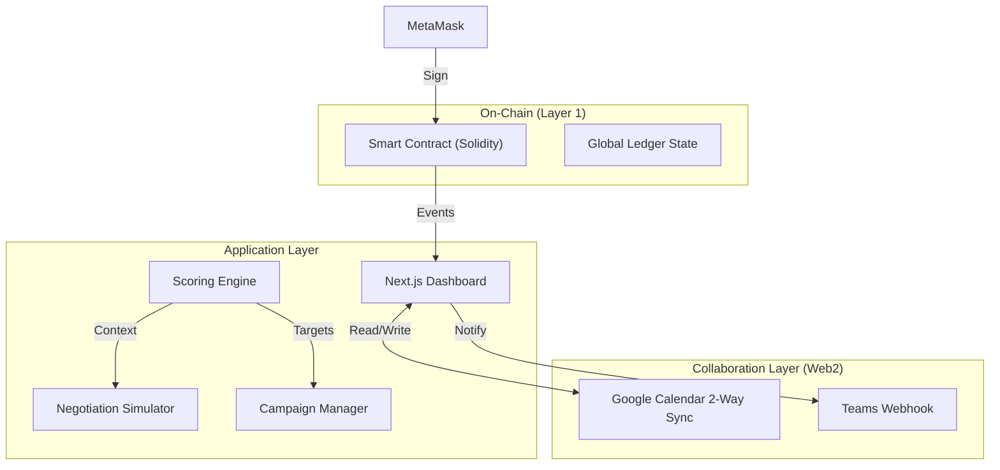

# P2: The Decentralized Future - Blockchain Insurance DApp

## 🚀 Mission Statement
P2 represents the immutable future of insurance. By moving the "System of Record" from a centralized database to the **Ethereum Sepolia Blockchain**, P2 creates a trust-minimized environment where Brokers and Customers interact directly via Smart Contracts.

> **⚠️ MANDATORY ARCHITECTURE STATEMENT**:
> **"No document ingestion, RAG, or embeddings/vector DB used. This system utilizes connector-first in-context synthesis only."**

---

## 🏗️ Architecture: The Web3 Stack

P2 leverages a cutting-edge **Decentralized Application (DApp)** architecture fused with Web2 collaboration tools.

---

## 💻 Source Code & Implementation Details

### 1. Smart Contract Integration
We interact directly with the deployed contract on the Sepolia Testnet.

*   **Read**: `getPolicy(hash)` - Pulls immutable truth from the chain.
*   **Write**: `createPolicy(...)` - Mints new coverage tokens.
*   **Event Listeners**: The UI subscribes to `PolicySigned` events to update state in real-time without refreshing.

### 2. The Collaboration Layer (Web2 Bridge)
While the record is on-chain, productivity happens in the tools Brokers use daily.

*   **Google Calendar Two-Way Sync**:
    *   *Implementation*: `app/api/calendar/create` & `sync`.
    *   *Function*: Auto-Generated schedules in the DApp are **pushed** to the broker's real Google Calendar.
*   **Relationship Intelligence**:
    *   *Implementation*: `connector-graph.tsx` & `relationship-timeline.tsx`.
    *   *Function*: Visualizes the "Social Proof" of a policy holder, aggregating off-chain communications (Email/Teams) alongside on-chain transactions.
*   **Campaign Automation**:
    *   *Implementation*: `app/api/generate-campaign-email`.
    *   *Function*: Auto-generates personalized renewal outreach for batches of smart contracts expiring within 60 days.

---

## 🛠️ Setup Instructions (P2 Specific)

1.  **Wallet Setup**: Install **MetaMask** browser extension.
2.  **Network**: Switch MetaMask to **Sepolia Testnet**.
3.  **Faucet**: Ensure you have a small amount of Sepolia ETH (for gas fees).
4.  **Connect**:
    *   Click "Connect Wallet" in the DApp top bar.
    *   Approve the connection request.
5.  **Calendar Authorization**:
    *   Navigate to the "Calendar & AI" tab.
    *   Click "Connect Calendar" to authorize Google OAuth scopes (Read/Write).

---

## 🔒 Security Notes

1.  **Immutability**: Once a policy is "Signed" by the customer on-chain, its coverage terms cannot be altered by the Broker. This prevents "silent edits" and fraud.
2.  **Trust-Minimized**: The logic engine runs on the client, but the *data* comes from the blockchain. The user doesn't need to trust the dashboard server, only the transparent Smart Contract code.
3.  **Secure Collaboration**: Calendar tokens are stored in `httpOnly` cookies with strict release policies, ensuring 3rd party integrations doesn't compromise wallet security.

---

*System Status: **Active** | Network: **Sepolia Testnet** | Contract: **Verified** | Framework: **Next.js + Ethers.js***
