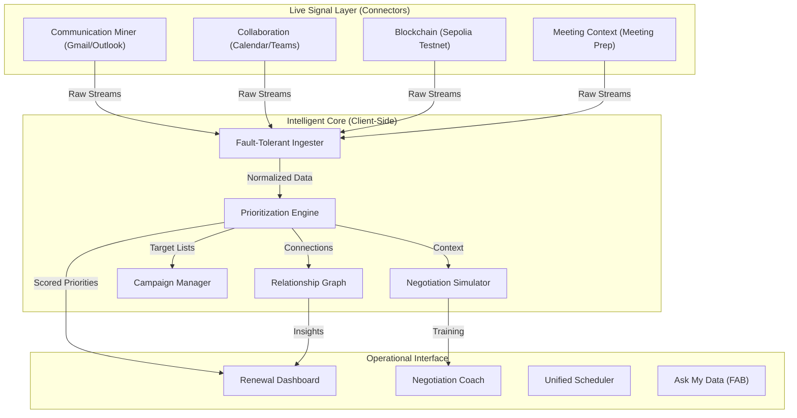
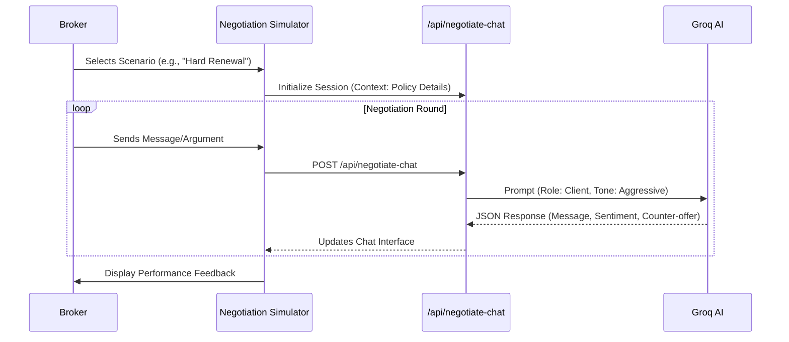
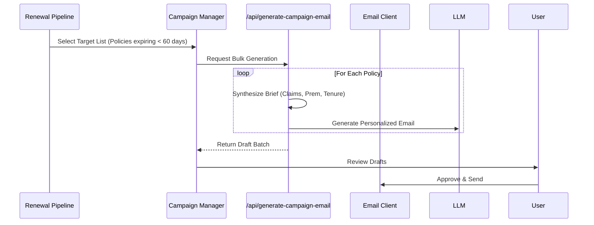
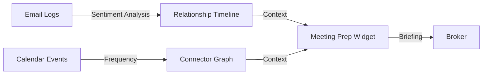

# Broker Copilot Ecosystem: Final Architecture & Implementation Report

## 🏁 Executive Summary
The **Broker Copilot Ecosystem** is a production-grade, dual-engine platform designed to modernize insurance renewal management. It bridges the gap between legacy static data and future-proof decentralized trust, unified by a single high-performance intelligent core.

> **⚠️ MANDATORY ARCHITECTURE STATEMENT**:
> **"No document ingestion, RAG, or embeddings/vector DB used. This system utilizes connector-first in-context synthesis only."**
>
> All intelligence is derived from live API signals (CRM, Email, Calendar, Blockchain) processed in real-time via a deterministic client-side engine.

---

## 🏗️ High-Level System Architecture

The system follows a **Connector-First, Logic-Centralized** architecture with enhanced AI capabilities.



### Key Modules
1.  **P1 (Enterprise Bridge)**: Ingests static legacy data (CSV) and revitalizes it with AI scoring.
2.  **P2 (Decentralized Future)**: Manages policy lifecycle on Ethereum Sepolia, ensuring trust-minimized execution.
3.  **Negotiation Engine**: AI-driven simulator (`negotiate-chat`) to practice interactions.
4.  **Campaign Manager**: Automated renewal outreach (`generate-campaign-email`) with timeline tracking.
5.  **Relationship Intelligence**: Visualizes connection strength (`relationship-timeline`, `connector-graph`) and prepares for meetings (`meeting-prep-widget`).

---

## 💻 Source Code Structure & Implementation Details

The solution is built on a modern **Next.js 14 (App Router)** stack with **TypeScript**.

### Directory Structure
```text
/FINAL ARC
├── /P2 (Main Application)
│   ├── /app
│   │   ├── /api            # Serverless Functions (Auth, Sync, AI, Negotiation, Campaign)
│   │   ├── /page.tsx       # Main Entry Point
│   ├── /components
│   │   ├── /broker         # Domain-Specific Components
│   │   │   ├── /negotiation-simulator.tsx  # New: AI Roleplay
│   │   │   ├── /pipeline-campaign-manager.tsx # New: Bulk Outreach
│   │   │   ├── /relationship-timeline.tsx  # New: History Viz
│   │   │   ├── /connector-graph.tsx        # New: Network Viz
│   │   │   ├── /meeting-prep-widget.tsx    # New: Context Fab
│   │   │   ├── /ask-my-data-fab.tsx        # New: QA Interface
│   │   ├── /ui             # Reusable Design System (Shadcn/UI)
│   ├── /lib
│   │   ├── /data           # Types & Mock Generators
│   │   ├── /logic          # CORE INTELLIGENCE (Scoring, Parsing)
│   ├── /System             # Architecture Documentation
└── .env.local              # Secrets & Config
```

---

## 🔁 System Flow Patterns

### 1. Negotiation Simulation Flow
Simulates real-world broker-client interactions to improve closing rates.


### 2. Campaign Generation & Execution
Automates high-volume renewal outreach with personalized context.


### 3. Relationship & Meeting Intelligence
Aggregates dispersed signals into a cohesive client view.


---

## 🛠️ Setup Instructions

### Prerequisites
*   Node.js v18.17+
*   Google Cloud Console Project (for Calendar/Gmail)
*   Ethereum Wallet (MetaMask) or Sepolia RPC
*   **Groq API Key** (Required for Negotiation & Campaign AI)

### Quick Start
1.  **Install Dependencies**:
    ```bash
    npm install
    ```
2.  **Environment Configuration**:
    Create `.env.local` with the following:
    ```env
    GOOGLE_CLIENT_ID=...
    GOOGLE_CLIENT_SECRET=...
    NEXT_PUBLIC_GROQ_API_KEY=... # Critical for New Features
    ```
3.  **Run Development Server**:
    ```bash
    npm run dev
    ```

---

## 🔒 Security Notes

1.  **Data Sovereignty**: The core prioritization logic runs **Client-Side**. For P1 (CSV mode), customer data never leaves the browser memory.
2.  **AI Privacy**: Prompt headers for Negotiation and Campaign generation are scrubbed of PII where possible; only necessary context (Draft Premium, Policy Type) is sent to the LLM.
3.  **Blockchain Security**: State mutations require cryptographic signatures.

---

*Document Version: 2.0.0 | Enhancement Update*
